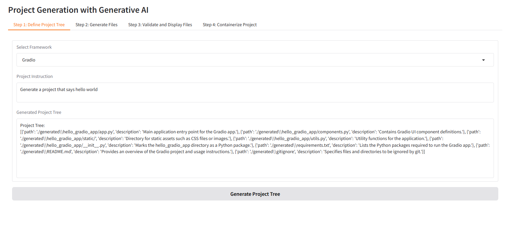
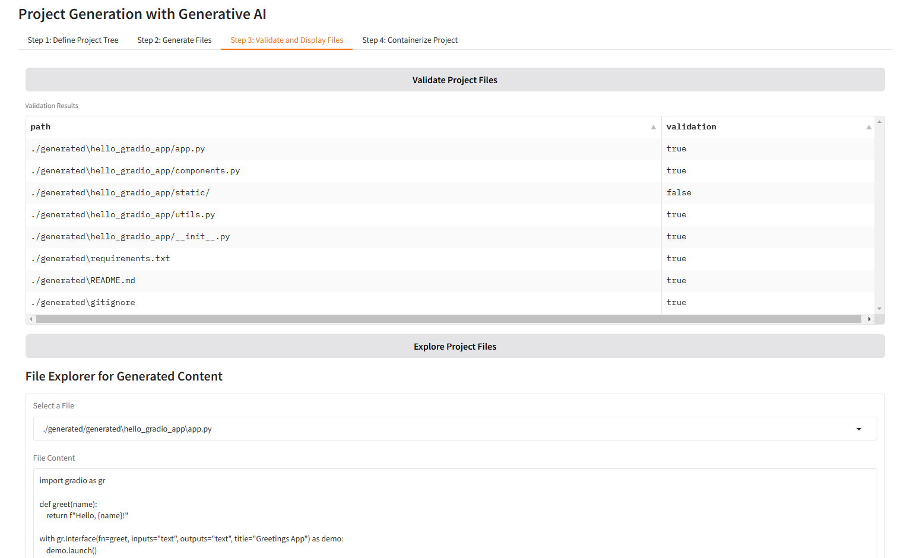
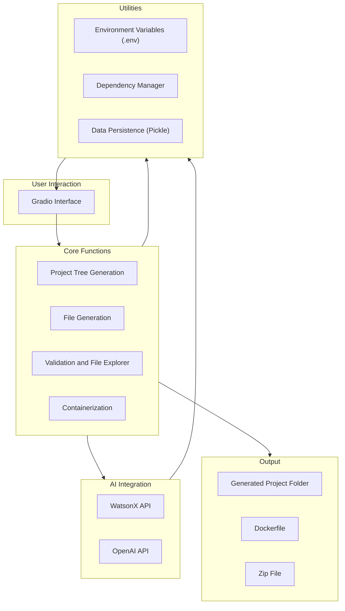

# Factory App AI


Factory App AI is an innovative application that enables users to dynamically generate project structures and code using generative AI model with WatsonX API  and  OpenAI. The app provides a user-friendly interface powered by Gradio to define project requirements, generate files, validate outputs, and containerize the projects for deployment. This application is designed to streamline project development but may require manual adjustments to the generated content for optimal functionality.

## Table of Contents

- [Features](#features)
- [Installation](#installation)
  - [Requirements](#requirements)
  - [Building and Running without Docker](#building-and-running-without-docker)
  - [Building and Running with Docker](#building-and-running-with-docker)
- [Usage](#usage)
  - [Steps](#steps)
- [Contributing](#contributing)
- [License](#license)

## Features

- **Dynamic Project Tree Generation**: Generate project structures based on user input and selected frameworks.
- **File Generation**: Create project files with dependency handling.
- **File Validation**: Validate generated files and ensure all dependencies are met.
- **File Explorer**: Browse and inspect generated project files.
- **Containerization**: Automatically generate Dockerfiles and save projects as zip files for deployment.
- **Interactive Gradio Interface**: User-friendly UI to guide through the process.

Example of WebAapp

### Generation of the Project

### Validation of the Files

### Containerization and deploy



## Installation

### Requirements

- Python 3.9+
- Node.js (for running without Docker)
- Docker (optional, for containerized deployment)
- Gradio
- OpenAI API key and Hugging Face API key configured in `.env`.

### Building and Running without Docker

```bash
# Install dependencies
pip install -r requirements.txt
# Start the application
python app.py
````