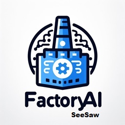
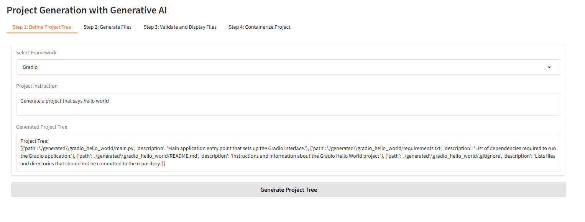
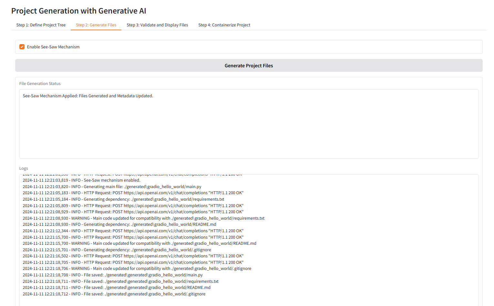
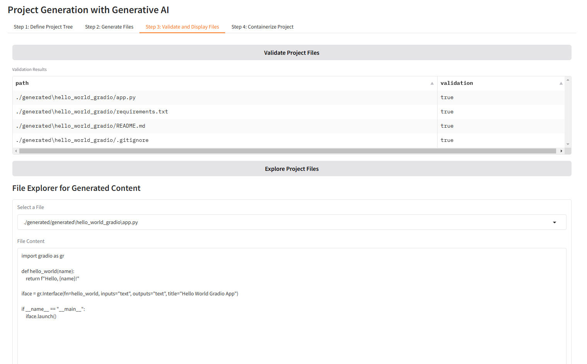
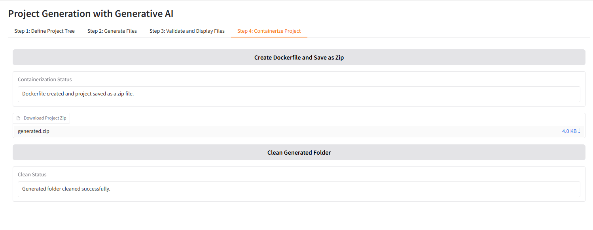
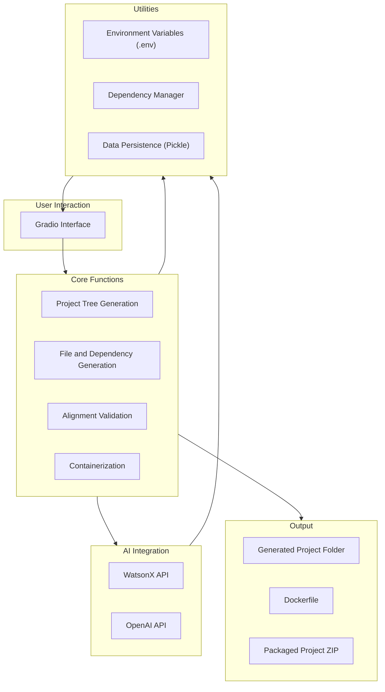

# FactoryAI SeeSaw



FactoryAI SeeSaw is an advanced application designed to generate scalable, coherent, and containerized project structures using the **See-Saw Mechanism**, as described in the accompanying research paper. The application leverages generative AI models through WatsonX API and OpenAI to automate project tree generation, code alignment, dependency validation, and containerization.

## Table of Contents

- [Features](#features)
- [Methodology](#methodology)
- [Installation](#installation)
  - [Requirements](#requirements)
  - [Building and Running without Docker](#building-and-running-without-docker)
  - [Building and Running with Docker](#building-and-running-with-docker)
- [Usage](#usage)
  - [Steps](#steps)
- [Contributing](#contributing)
- [License](#license)

---

> **Note:** This project implements the **SeeSaw Method** as referenced in [arXiv:2411.10861](https://arxiv.org/abs/2411.10861). 

## Features

- **Dynamic Project Tree Generation**: Automatically generate a hierarchical project tree based on input requirements and selected frameworks using the See phase.
- **Incremental File and Dependency Creation**: Generate project files and dependencies iteratively during the Saw phase.
- **Alignment Validation**: Validate coherence between main files and their dependencies using a robust validation mechanism.
- **Interactive Gradio Interface**: Streamlined user interface for defining requirements, generating files, and exploring project structure.
- **Containerization and Deployment**: Automatically create Dockerfiles and package projects for deployment.
- **Comprehensive Workflow**: Implements the See-Saw Mechanism, ensuring iterative refinement and alignment.

---

## Methodology

The application implements the **See-Saw Mechanism**, consisting of the following key steps:

1. **Project Tree Generation**: Creates a hierarchical structure of main files and dependencies based on user input.
2. **Incremental File Generation (See Phase)**: Dynamically generates or refines main project files based on current dependencies.
3. **Dependency Handling (Saw Phase)**: Generates dependencies and aligns them with main files.
4. **Alignment Validation**: Uses AI-driven validators to ensure coherence between components, resolving inconsistencies when detected.
5. **Containerization**: Prepares the project for deployment by generating Dockerfiles and packaging the final structure.

The workflow alternates between See and Saw phases, iteratively refining the project structure. The alignment is validated at each step, guaranteeing a consistent and deployable output.

---

## Installation

### Requirements

- Python 3.9+
- Node.js (required for running without Docker)
- Docker (optional, for containerized deployment)
- WatsonX API and OpenAI API credentials configured in a `.env` file.

### Building and Running without Docker

1. Clone the repository:

   ```bash
   git clone https://github.com/ruslanmv/factoryai-seesaw.git
   cd factoryai-seesaw
   ```

2. Install the required dependencies:

   ```bash
   pip install -r requirements.txt
   ```

3. Start the application:

   ```bash
   python app.py
   ```

### Building and Running with Docker

1. Build the Docker image:

   ```bash
   docker build -t factoryai-seesaw .
   ```

2. Run the Docker container:

   ```bash
   docker run -p 7860:7860 factoryai-seesaw
   ```

---

## Usage

### Steps

1. **Define Requirements**: Use the Gradio interface to specify project requirements, such as frameworks and file structure.
2. **Generate Project Tree**: Initiate the process to dynamically create the hierarchical project structure.
3. **Refine and Validate**: Incrementally generate and validate main files and dependencies through See-Saw phases.
4. **Containerize and Deploy**: Package the project for deployment with automatically generated Dockerfiles.

Example of the application interface:

#### Project Tree Generation



#### Build Generation



#### File Validation


#### Containerization and Deployment

---

## Workflow Diagram



---

## Contributing

Contributions to FactoryAI SeeSaw are welcome. If you encounter issues or have feature suggestions, feel free to submit a pull request or open an issue in the repository.

---

## License

This project is licensed under the MIT License. See the `LICENSE` file for more details.
