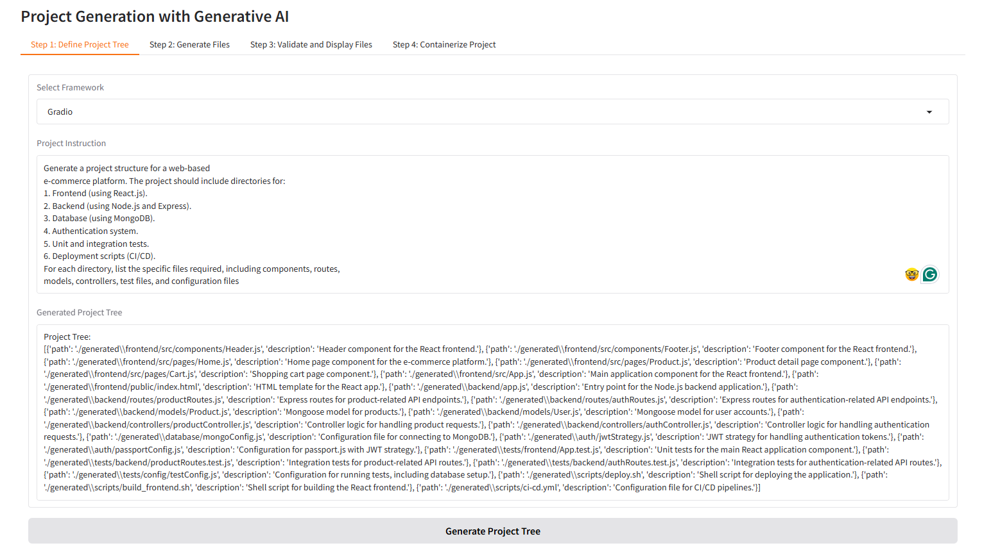
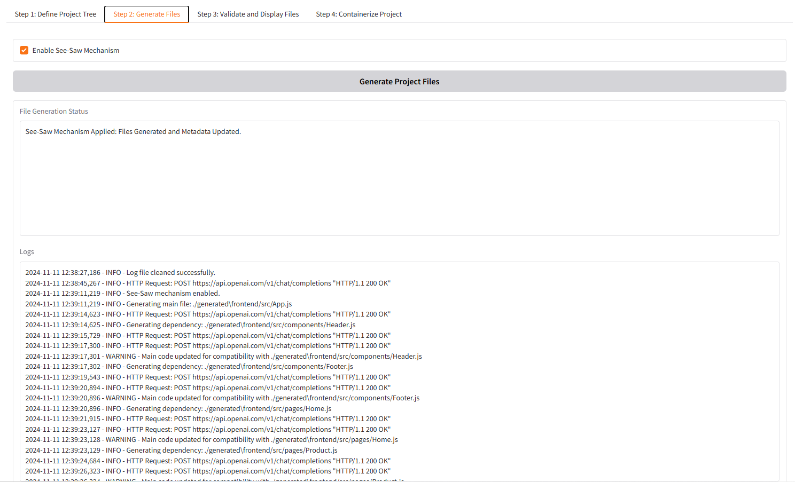
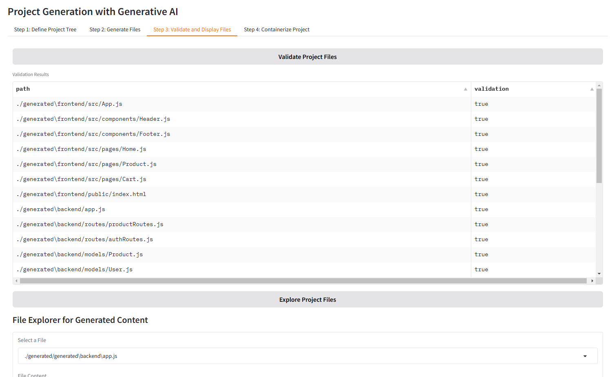
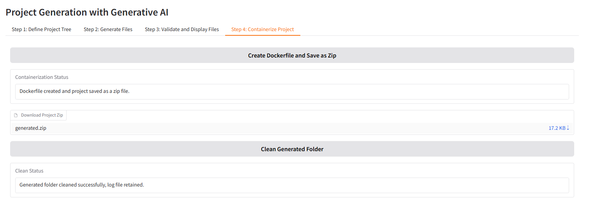

## E Comerce
Prompt:

```plaintext
Generate a project structure for a web-based
e-commerce platform. The project should include directories for:
1. Frontend (using React.js).
2. Backend (using Node.js and Express).
3. Database (using MongoDB).
4. Authentication system.
5. Unit and integration tests.
6. Deployment scripts (CI/CD).
For each directory, list the specific files required, including components, routes,
models, controllers, test files, and configuration files
```
#### Project Tree Generation

#### Build Generation

#### File Validation


#### Containerization and Deployment
